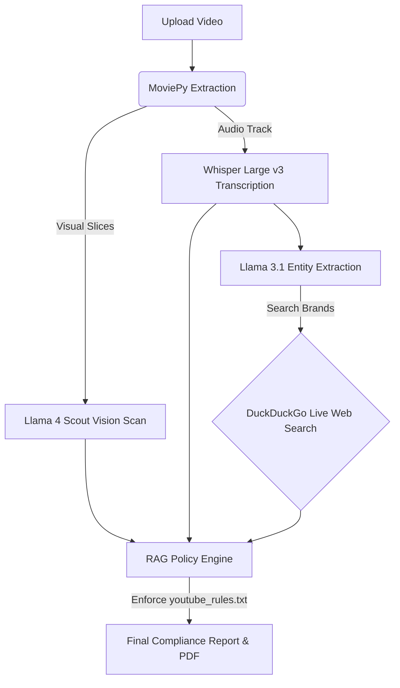

# 🛡️ TrustScout.ai
[](https://www.python.org/downloads/)
[](https://streamlit.io)
[](https://groq.com)

**Enterprise-Grade Multimodal AI Content Moderation & PR Auditing**

Manual content moderation is a bottleneck, often taking human reviewers up to 15 minutes to fully audit a 60-second video for visual risks, audio violations, and real-time PR context. **TrustScout.ai automates this entire workflow in seconds.** By leveraging state-of-the-art vision models, audio transcription, and a Retrieval-Augmented Generation (RAG) pipeline connected to the live internet, this agentic tool generates strict, policy-compliant PR and safety audits.


---

## 📊 The Impact & Results

TrustScout.ai doesn't just generate text; it provides actionable, enterprise-ready compliance data. 


### Key Deliverables:
1. **Dynamic Compliance Scoring:** A calculated, color-coded metric (0-100%) grading the overall safety of the content.
2. **Frame-by-Frame Visual Audit:** Slices video into keyframes and scans for brand risks, gestures, and visual policy violations.
3. **Agentic PR Context:** Extracts brands mentioned in the audio, searches the live internet for breaking controversies, and warns you *before* you post.
4. **PDF Export:** Generates a clean, downloadable `PR_Safety_Audit.pdf` for compliance record-keeping.


---

## 🚀 The Agentic Architecture

TrustScout.ai utilizes a multi-step, multimodal pipeline to cross-reference video content against live data and strict text rulebooks.



---
## 🛠️ Tech Stack & Capabilities

| Layer | Technology | Function |
| :--- | :--- | :--- |
| **Frontend/UI** | `Streamlit` | Enterprise dashboard and interactive data frames. |
| **Inference Engine** | `Groq API` | Lightning-fast LPU processing for near-instant results. |
| **Vision Model** | `Llama-4-Scout-17b` | Zero-shot visual policy detection on sequential frames. |
| **Audio Model** | `Whisper-large-v3` | High-fidelity audio transcription with precise timestamping. |
| **Live Data** | `duckduckgo-search` | Automated background pipeline for real-time PR controversy checks. |
| **Export Engine**| `fpdf2` & `RegEx` | Parses LLM output to generate formatted PDF compliance reports. |

---

## 💻 Run It Locally

**1. Clone the repository:**
```bash
https://github.com/Afwan-Insights/trustscout-ai.git
```

**2. Install dependencies:**
```bash
pip install -r requirements.txt
```

**3. Configure Credentials:**
Create a `.streamlit/secrets.toml` file in the root directory and add your Groq API key:
```toml
GROQ_API_KEY = "your_api_key_here"
```

**4. Run the application:**
```bash
streamlit run app.py
```

---
